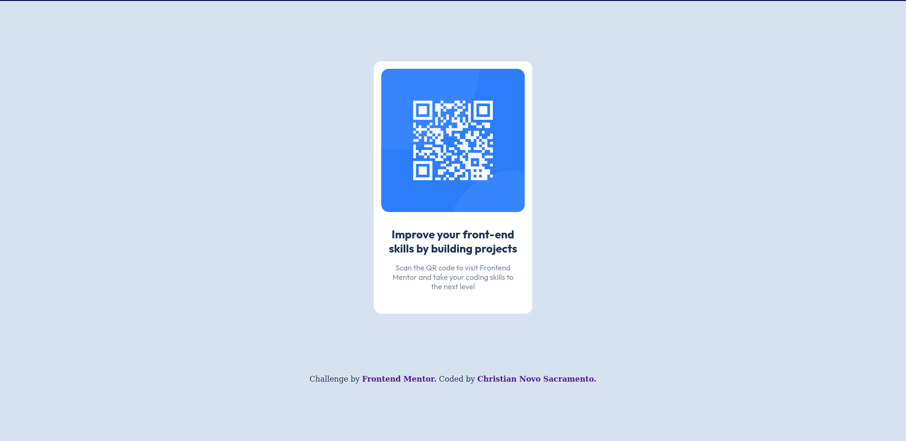

# Frontend Mentor - QR code component solution

This is a solution to the [QR code component challenge on Frontend Mentor](https://www.frontendmentor.io/challenges/qr-code-component-iux_sIO_H). Frontend Mentor challenges help you improve your coding skills by building realistic projects. 



## Table of contents

- [Links](#links)
- [Build with](#built-with)
- [File structure](#file-structure)

## Links

- Frontend Mentor - [@cnsacramento](https://www.frontendmentor.io/profile/cnsacramento)
- Solution URL: [Add solution URL here](https://your-solution-url.com)
- Live Site URL: [Netlify](https://app.netlify.com/sites/cnsacramento-fm-qr-code-component/deploys)

## Built with

- Semantic HTML5 markup
- CSS custom properties
- Flexbox

## File Structure

```
 .
├──  design
│   ├──  desktop-design.jpg
│   ├──  desktop-preview.jpg
│   └──  mobile-design.jpg
├──  images
│   ├──  favicon-32x32.png
│   ├──  image-qr-code.png
│   └──  qr-component.png
├──  index.html
├──  README.md
├──  style-guide.md
└──  styles
    └──  style.css
```
