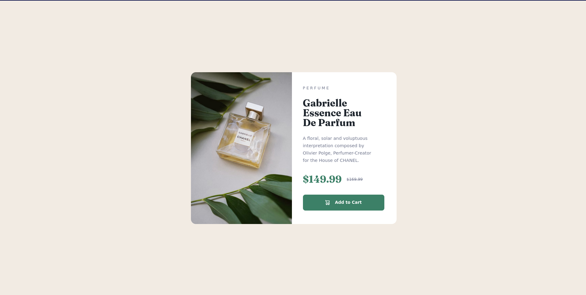

# Frontend Mentor - Product preview card component solution

This is a solution to the [Product preview card component challenge on Frontend Mentor](https://www.frontendmentor.io/challenges/product-preview-card-component-GO7UmttRfa). Frontend Mentor challenges help you improve your coding skills by building realistic projects. 

<div align="center">
  
  
</div>

## Table of contents

- [Links](#links)
- [Build with](#built-with)
- [File structure](#file-structure)

## Links

- Frontend Mentor - [@cnsacramento](https://www.frontendmentor.io/profile/cnsacramento)
- Solution URL: [My solution](https://www.frontendmentor.io/solutions/product-preview-card-component-ez7gH0hGDc)
- Live Site URL: [Netlify](https://cnsacramento-fm-product-preview.netlify.app/)

## Built with

- Semantic HTML5 markup
- CSS custom properties
- CSS Flexbox
- CSS Grid
- Mobile-first workflow

## Useful resources
* [Picture tag](https://www.geeksforgeeks.org/html-picture-tag/)
* [Ins tag](https://developer.mozilla.org/es/docs/Web/HTML/Element/ins)
* [Overflow property](https://developer.mozilla.org/en-US/docs/Web/CSS/overflow)
* [&nbsp entity](https://english.stackexchange.com/questions/28467/when-is-it-appropriate-to-use-non-breaking-spaces/28476#28476)


## File Structure

```
 .
├──  design
│   ├──  active-states.jpg
│   ├──  desktop-design.jpg
│   ├──  desktop-preview.jpg
│   └──  mobile-design.jpg
├──  html
│   └──  index.html
├──  images
│   ├──  desktop-product-preview-card-component.png
│   ├──  favicon-32x32.png
│   ├──  icon-cart.svg
│   ├──  image-product-desktop.jpg
│   ├──  image-product-mobile.jpg
│   └──  mobile-product-preview-card-component.png
├──  README.md
├──  style-guide.md
└──  styles
    └──  style.css
```
